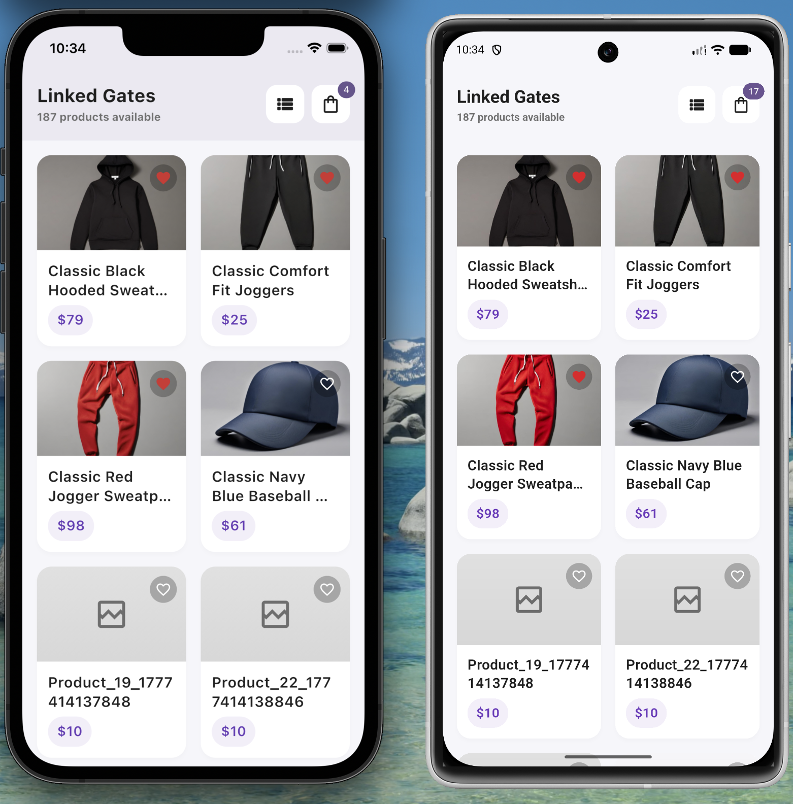
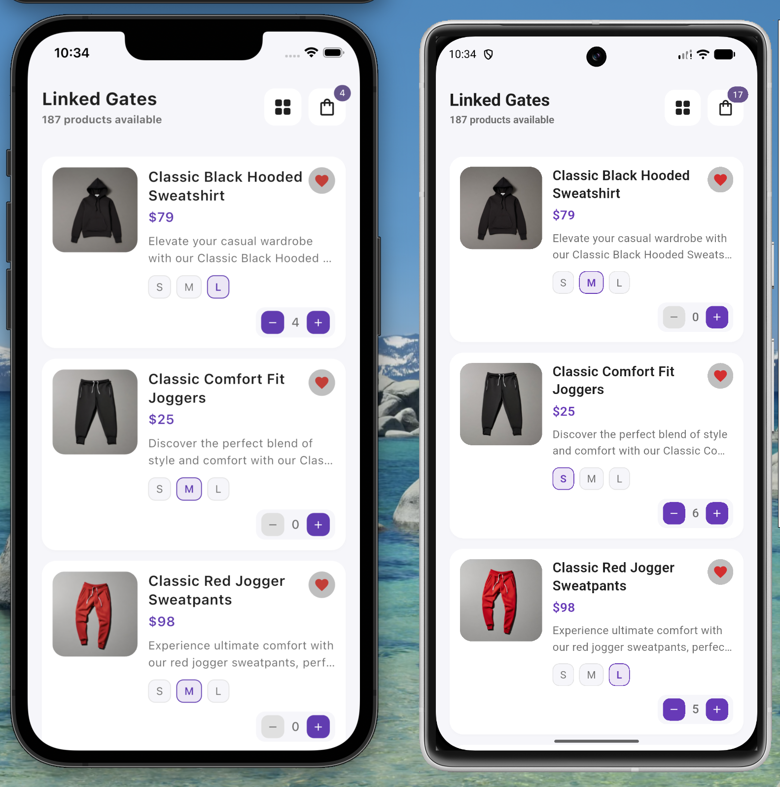
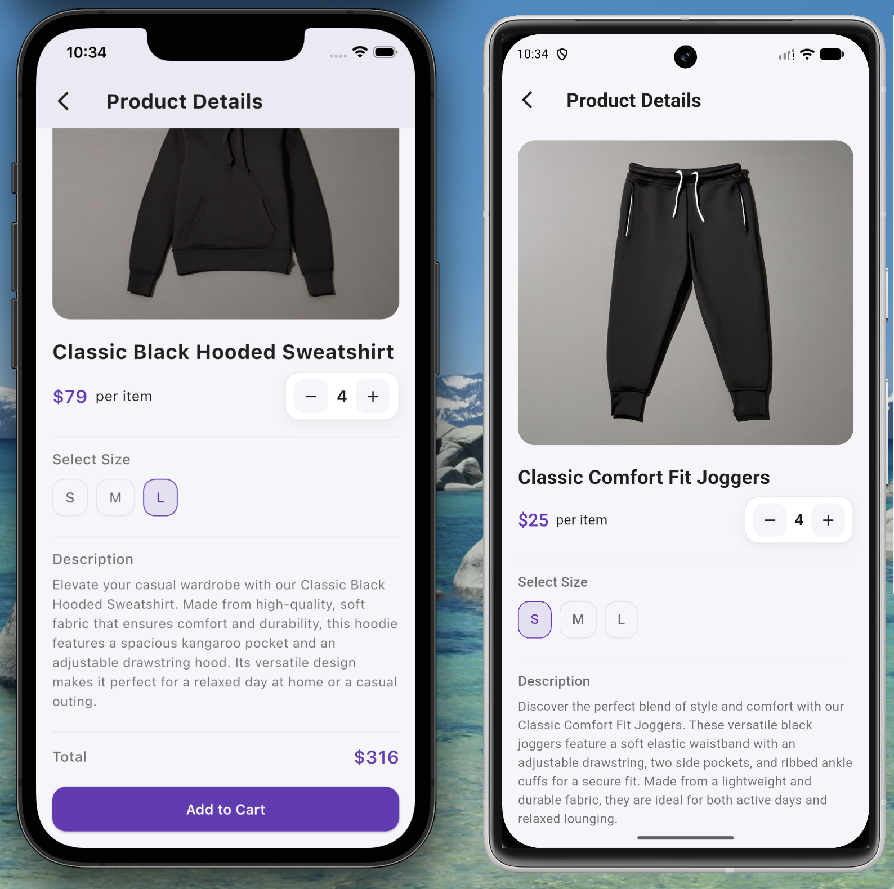
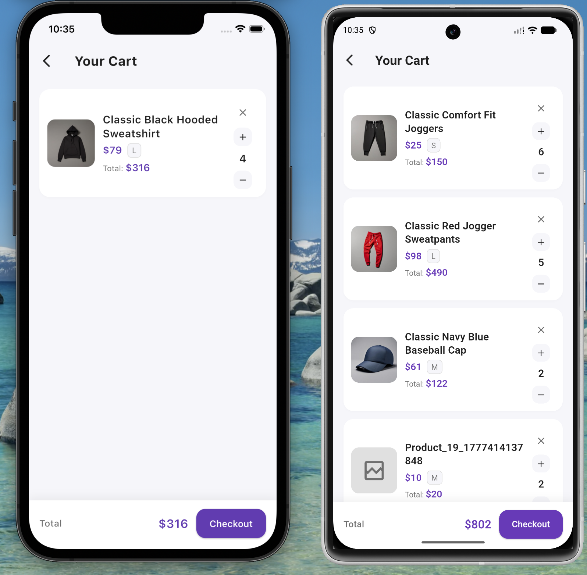

# Linked Gates Project

<p align="center">
  
</p>

## Demo Video (Mobile / iOS)

Single combined record of the main flow (Products → Product Details → Cart):

<div align="center">
  <video src="screen_reocords/ios_android_record.mov" controls preload="metadata" width="360"></video>
</div>

[Open / download recording](screen_reocords/ios_android_record.mov)

## Screenshots

### Products — Grid


### Products — List


### Product Details


### Cart


---

The current flow covers three core screens:

- `Products` screen with grid/list layouts
- `Product Details` screen with size and quantity selection
- `Cart` screen with quantity updates and total calculation

## Overview

This project is designed as a practical technical assessment app rather than a large production commerce platform. The focus is on code organization, user experience, reusable widgets, and maintainable architecture.

The app fetches products from a remote API, presents them in a responsive catalog, allows the user to inspect product details, and supports adding items to an in-memory cart with live pricing updates.

## Key Highlights

- Clean feature-based structure with separation between `data`, `domain`, and `presentation`
- `Provider`-based state management with targeted rebuilds using `Consumer` and `Selector`
- Dependency injection with `GetIt`
- API integration using `Dio` and `Retrofit`
- Responsive sizing with `flutter_screenutil`
- Smooth UX touches such as shimmer loading, animated product cards, hero transitions, and toasts
- Android and iOS app branding support through splash and launcher icon tooling

## User Journey

### 1. Products Screen

The home screen is the main entry point of the app. It loads products from the API and gives the user two ways to browse the catalog:

- Grid layout for a more visual shopping experience
- List layout for richer item information, including size and quantity quick controls
- Favorite toggling for product cards
- Cart badge in the app bar showing the current number of items
- Double-back press exit feedback on Android

### 2. Product Details Screen

Selecting a product opens a detailed view where the user can:

- View a larger product image with transition animation
- Read the product title and description
- Adjust quantity
- Choose a size
- See the calculated total price before adding to cart
- Add the selected configuration to the cart

### 3. Cart Screen

The cart screen provides a simple review experience:

- List of selected items
- Quantity increase/decrease actions
- Item removal behavior
- Live total price updates
- Checkout button placeholder for future expansion

## Architecture

The project follows a feature-first, layered approach.

### Presentation Layer

Handles UI rendering and state interaction:

- Screens live under each feature's `presentation/screens`
- Reusable UI sections live under `presentation/widgets`
- State is managed with `ChangeNotifier` providers

### Domain Layer

Contains the business-facing contracts and use cases:

- Entities represent the app's core models
- Repository abstractions define feature behavior
- Use cases expose focused actions such as getting products or modifying cart state

### Data Layer

Handles implementation details:

- Retrofit service for API communication
- Remote data source for network operations
- Repository implementations that map raw data into domain entities

## Technical Stack

- `Flutter` for cross-platform UI
- `Provider` for state management
- `GetIt` for dependency injection
- `Dio` + `Retrofit` for REST API communication
- `json_serializable` for model serialization
- `cached_network_image` for remote image loading
- `shimmer` for loading placeholders
- `flutter_screenutil` for responsive sizing
- `device_preview` for screen simulation during development
- `fluttertoast` for lightweight user feedback

## API Source

Products are loaded from:

- `https://api.escuelajs.co/api/v1/products`

The base URL is configured in `lib/core/utils/constants.dart`.

## Routing

Named routes are defined in `lib/app_router.dart`:

- `/products`
- `/products/details`
- `/cart`

The router also handles:

- Provider injection for each route
- Route argument validation
- Custom fade/slide transitions for secondary screens

## Project Structure

```text
lib/
  core/
    di/                 # dependency injection setup
    error/              # app-level exception handling
    extensions/         # shared extensions such as price formatting
    network/            # Dio client configuration
    styles/             # colors, typography, theme
    utils/              # constants and UI data helpers
    widgets/            # reusable shared widgets
  features/
    products/
      data/             # API service, data sources, models, repositories
      domain/           # entities, repositories, use cases
      presentation/     # providers, screens, widgets
    product_details/
      presentation/     # details screen composition widgets
    cart/
      data/             # cart repository implementation
      domain/           # cart entities, contracts, use cases
      presentation/     # cart provider, screen, widgets
  app_router.dart       # app routing and transitions
  main.dart             # application entry point
```

## State Management Summary

### `ProductProvider`

Responsible for:

- Fetching products
- Managing loading and error states
- Switching between grid and list layouts
- Handling local favorite state
- Managing selected size and quantity per product
- Preparing display-friendly product descriptions and prices

### `CartProvider`

Responsible for:

- Adding items to the cart
- Updating item quantity
- Removing items
- Clearing the cart
- Exposing cart totals for UI updates

## Current Implementation Notes

- The cart is currently stored in memory through `CartRepositoryImpl`
- Product data is fetched remotely each app session
- Checkout is intentionally left as a future enhancement
- Favorites are UI state only and are not persisted

## Running the Project

### Prerequisites

- Flutter SDK (stable channel)
- Dart SDK
- Android Studio or Android SDK
- Xcode for iOS builds on macOS

### Install Dependencies

```bash
flutter pub get
```

### Run the Application

```bash
flutter run
```

### Analyze the Project

```bash
flutter analyze
```

### Run Tests

```bash
flutter test
```

## Code Generation

This project uses generated files for Retrofit and JSON serialization.

Run generation with:

```bash
dart run build_runner build --delete-conflicting-outputs
```

## App Branding

### Splash Screen

Configuration file:

- `flutter_native_splash.yaml`

Regenerate splash assets:

```bash
dart run flutter_native_splash:create
```

### Launcher Icons

Launcher icon configuration is defined in `pubspec.yaml`.

Regenerate icons with:

```bash
dart run flutter_launcher_icons
```

## Media

Screenshots and the demo recording are shown at the top of this README.

## Why This Submission Is Strong

This project demonstrates more than basic screen building. It shows:

- Structured Flutter architecture
- Reusable and maintainable UI composition
- Separation of responsibilities across layers
- Responsive design decisions
- Clear room for future enhancements such as persistence, authentication, and checkout

## Possible Future Enhancements

- Persist cart and favorites locally
- Add search, filtering, and category support
- Add unit and widget test coverage for more flows
- Implement checkout flow
- Add offline handling and retry states

## License

This repository is intended for assessment and demonstration purposes unless a separate license is added.
